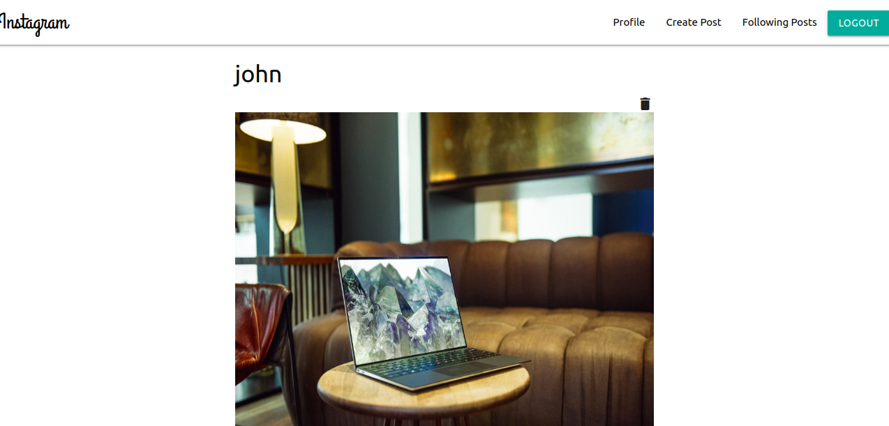
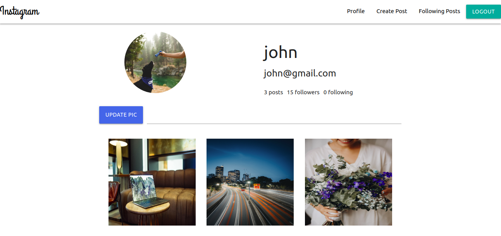
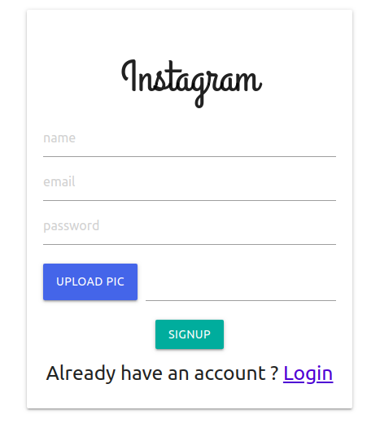

# instagram-clone

### visit website [here](https://instagram-clone19.herokuapp.com)

this is mern stack project in which user can login then create any post, view their profile, follow others, delete post, comment on post etc.

### to get started
clone the repository
run command npm install to install all dependency
run command npm start to start express server
cd client, run command npm start to start development server

## images

home screen

profile screen

signup screen

